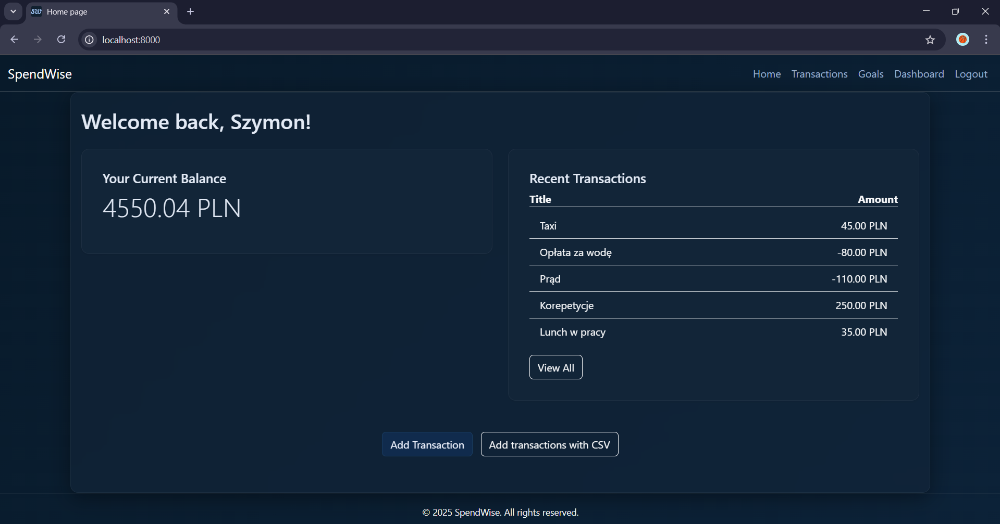
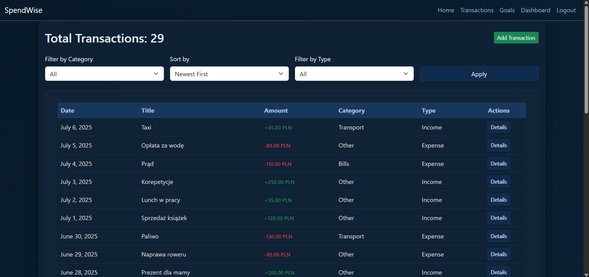
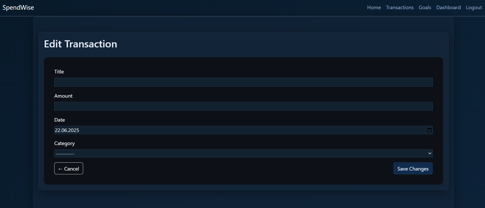
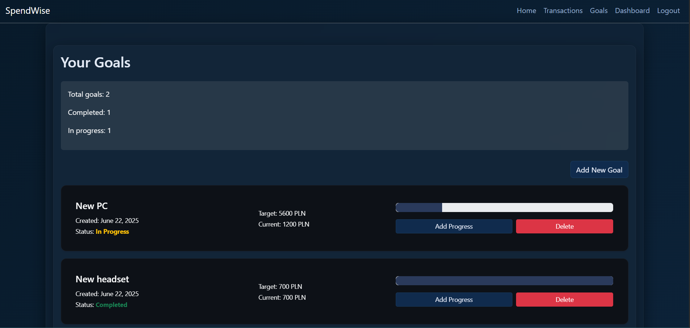
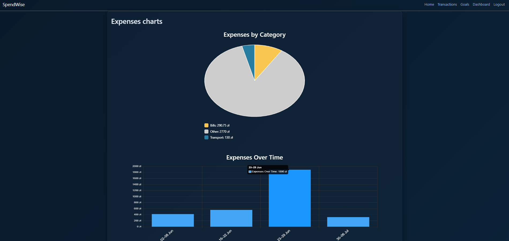

# 💰 SpendWiser – Personal Finance Tracker

**SpendWiser** is a modern Django-based web application that helps users manage their personal finances, set goals, and track spending with categorized transactions and visual insights.

> 🧠 **Note**  
> This project is a continuation and redesign of my earlier app **SpendWise**  
> focused on REST APIs. SpendWiser improves architecture, UX/UI, and expands functionality.

---

<br>

## 🚀 Features

| Feature                        | Description                                      |
|-------------------------------|--------------------------------------------------|
| 🔐 Authentication             | Secure login, registration, logout               |
| 📁 CSV Import                 | Upload and parse bank transaction files          |
| 🧠 Auto Categorization        | Intelligent keyword-based category matching      |
| 🎯 Financial Goals            | Set goals and track your progress                |
| 📊 Visual Insights            | Charts with filtering by category and date       |
| ⚙️ Category Management        | Manual and bulk editing of transaction categories|
| 🐳 Docker Support             | Containerized environment with PostgreSQL        |

<br>

## 🛠️ Tech Stack

- **Backend**: Django, Django ORM, PostgreSQL
- **Frontend**: Django Templates, Bootstrap 5, Chart.js
- **Authentication**: Django built-in auth system
- **Containerization**: Docker, docker-compose
- **Others**: dotenv for environment management, CSV parser

---

## 📚 API Endpoints Documentation

### 🔐 Authentication & User

- `POST /api/register/`  
  **Register a new user account.**  
  Requires user details like email and password.

- `POST /api/token/`  
  **Obtain JWT tokens (access & refresh).**  
  Requires valid login credentials (email and password).

- `POST /api/token/refresh/`  
  **Refresh JWT access token using a refresh token.**  
  Requires a valid refresh token.

- `GET /api/profile/`  
  **Retrieve the profile data of the currently authenticated user.**  
  Authorization required.

- `PUT /api/profile/`  
  **Update the profile data of the authenticated user.**  
  Allows changing fields such as email, username.  
  Authorization required.

<br>

### 💸 Transactions

- `GET /transactions/api/`  
  **List all user transactions.**  

- `POST /transactions/api/`  
  **Create a new transaction.**  

- `PUT /transactions/api/<id>/`  
  **Edit details of a specific transaction by ID.**  

- `GET /transactions/api/<id>/`  
  **Retrieve details of a specific transaction by ID.**

- `DELETE /transactions/api/<id>/`  
  **Delete a specific transaction by ID.**

- `GET /transactions/api/import/`  
  **Import sample transactions from a CSV file.**  
  Loads data from `backend/data/sample_transactions.csv`.  
  Make sure the file exists and the name matches the one used in `ImportTransactionView`.

<br>

> 🛠️ **Note:** All endpoints requiring authentication must include a valid JWT access token in the `Authorization` header:
> ```
> Authorization: Bearer <your_access_token>
> ```

---

## 🐳 Getting Started - *with Docker*  
Follow these steps to set up and run SpendWiser locally:

1. **Clone the repository**  
    ```bash
    git clone https://github.com/LuckyS-J/SpendWiser.git
    ```

2. **Navigate to the project**  
    ```bash
    cd SpendWiser
    ```

3. **Create a `.env` file**  
Create a file named `.env` in the project root and add the following environment variables. Replace the placeholder values with your own settings:

    ```env
    SECRET_KEY='your_secret_key_here'
    DEBUG=True
    DB_ENGINE=django.db.backends.postgresql
    DB_NAME=SpendWiser
    DB_USER='your_username'
    DB_PASSWORD='your_password'
    DB_HOST=db
    DB_PORT=5432
    POSTGRES_DB=SpendWiser
    POSTGRES_USER='your_username'
    POSTGRES_PASSWORD='your_password'
    ```
   

4. **Build Docker containers and run them**
    ```bash
   docker-compose up -d --build
   ```
   
5. **Open the app in your browser**

    Go to:  
    http://localhost:8000
   
6. **Shut down containers**  
    ```bash
   docker-compose down
    ```
---

## 🐍 Getting Started - *with PGSQL & python*
Follow these steps to set up and run SpendWiser locally:

1. **Clone the repository**  
    ```bash
   git clone https://github.com/LuckyS-J/SpendWiser.git
   ```

2. **Navigate to the backend directory**  
    ```bash
   cd SpendWiser
   ```

3. **Create a `.env` file**  
Create a file named `.env` in the project root and add the following environment variables. Replace the placeholder values with your own settings:

    ```env
    SECRET_KEY='your_secret_key_here'
    DEBUG=True
    DB_ENGINE=django.db.backends.postgresql
    DB_NAME=SpendWiser
    DB_USER='your_username'
    DB_PASSWORD='your_password'
    DB_HOST=localhost
    DB_PORT=5432
    ```

4. **Go to /backend**  
    ```bash
   cd ./backend
   ```

5. **Create a `.venv` file**  
    ```bash
   python -m venv .venv
   ```

6. **Active `.venv`**  
    ```bash
   .venv\Scripts\activate
   ```

7. **Install requirements**  
    ```bash
   pip install -r requirements.txt
   ```

8. **Run migrations**
    ```bash
   python manage.py migrate
   ```
   
9. **Start app**
    ```bash
   python manage.py runserver
   ```

10. **Open the app in your browser**

    Go to:  
    http://localhost:8000
   

---

## 📸 Screenshots

### Index
<p align="center">
  
</p>

### Transactions list
<p align="center">
  
</p>

### Form example
<p align="center">
  
</p>

### Goals list
<p align="center">
  
</p>

### Charts
<p align="center">
  
</p>


---

## ⚙️ Charts and AI Assistance

The visualizations (such as category and date-based expense charts) were implemented using [Chart.js](https://www.chartjs.org/).  
As I had limited experience with Chart.js, I used **AI assistance (ChatGPT)** to generate and integrate the JavaScript logic and styling.  
This allowed me to focus more on Django development and backend data processing.

---
